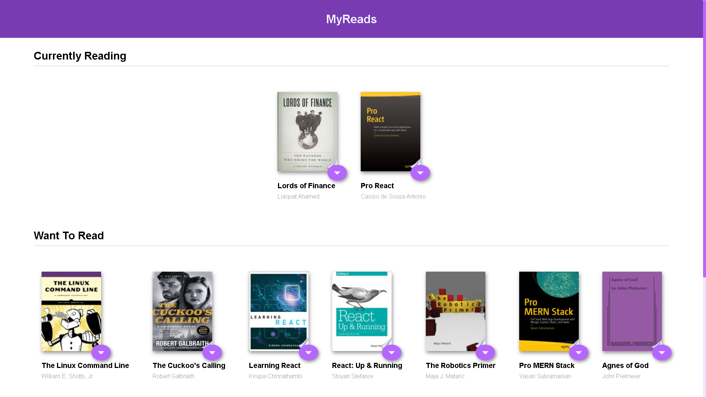

<div id="top"></div>


<br>
<br>
<br>
<br>

<!-- PROJECT LOGO -->
<div align="center">
  <h2>My Reads</h2>
</div>

<br>
<br>
<br>
<br>

<!-- TABLE OF CONTENTS -->

- Table of Contents
<ol>
  <li><a href="#overview">Overview</a></li>
  <li><a href="#stack">Stack</a></li>
  <li><a href="#getting-started">Getting Started</a></li>
  <li><a href="#installation">Installation</a></li>
  <li><a href="#preview">Preview -Live Demo-</a></li>
  <li><a href="#screenshots">Screenshots</a></li>
</ol>

<br>
<br>
<br>

<!-- ABOUT THE PROJECT -->

## Overview

### A Bookshelf app that allows you to select and categorize books you have read, are currently reading, or want to read. The project emphasizes using React to build the application and provides an API server and client library that you will use to persist information as you interact with the application.

<br>
<br>

## Stack

- React.js
- React-Router lib

---

<br>
<br>

<!-- GETTING STARTED -->

## Getting Started

This project require some prequesites and dependenscies to be installed, you can find the instructions below

> To get Started, follow these simple steps :

## Installation

1. Clone the repo

2. go to project folder

3. install dependencies

   ```bash
   npm i
   npm start
   ```

<br>
<br>

## Preview

[](https://fayad-myreads-react-redux-fwd.netlify.app)

<br>
<br>

## Screenshots

### Preview Image



### Tree Architecture


<br>
<br>

<p align="right">'<a href="#top">back to top</a>'</p>
